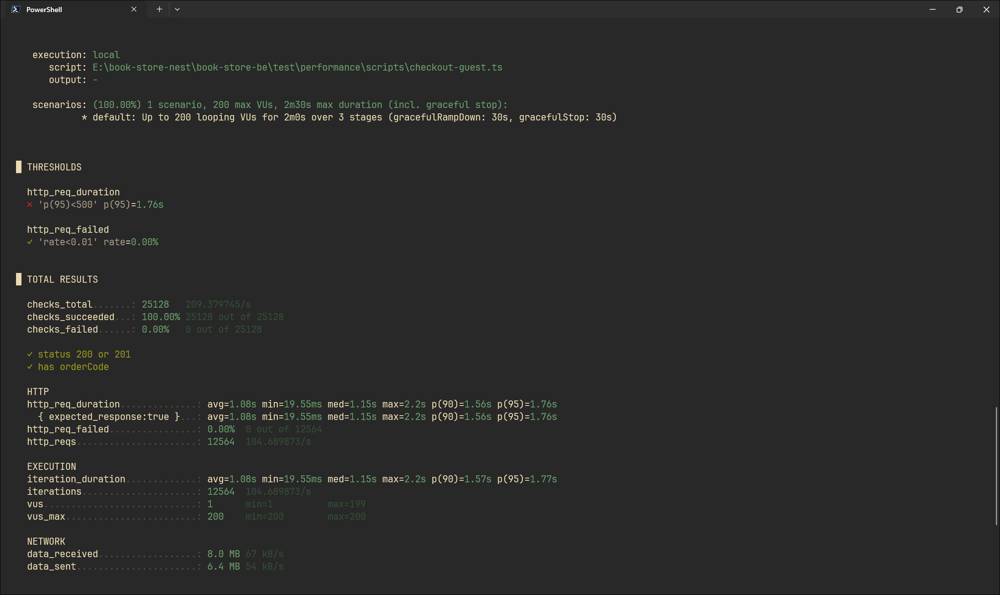

# Load Testing — Checkout Flow

## Environment

- Tool: k6
- Local machine (Windows, Docker MySQL + Redis)
- NestJS app + BullMQ worker chạy riêng 2 process
- MySQL connection_limit: 50
- BullMQ concurrency: 5

## Test Scenario

```typescript
stages: [
  { duration: '30s', target: 100 },
  { duration: '1m', target: 200 },
  { duration: '30s', target: 0 },
];
```

- 200 VUs concurrent
- Endpoint: POST /api/v1/orders/checkout (guest)
- Single variant, quantity 1
- Mỗi VU bấm liên tục không nghỉ

## Kết quả

| Phiên bản                      | Mô tả                                                                                      | Error Rate | p(95) | Iterations |
| ------------------------------ | ------------------------------------------------------------------------------------------ | ---------- | ----- | ---------- |
| v1 — Baseline                  | Prisma interactive transaction toàn bộ flow trong job + `doInTransaction` trong HTTP layer | 27.30%     | 7.05s | 3400       |
| v2 — Bỏ transaction HTTP layer | Xóa `doInTransaction` khỏi `createCheckout`, giữ transaction trong job                     | 0.00%      | 7.23s | 3413       |
| v3 — Tách snapshot ra ngoài tx | Snapshot không còn trong transaction, chỉ order + items + address                          | 0.00%      | 5.49s | 6499       |
| v4 — connection_limit 20 → 50  | Tăng pool size, đánh index thêm cho bookVariantId                                          | 0.00%      | 3.85s | 6175       |
| v5 — Final                     | Job có transaction, MySQL buffer warm, index đầy đủ                                        | 0.00%      | 2.44s | 8634       |
| v6 — Redis DECRBY              | Thay DB write bằng Redis atomic DECRBY                                                     | 0.00%      | 1.76s | 12564      |

## Root Cause

Prisma interactive transaction (`$transaction(async tx => ...)`) giữ 1 DB
connection suốt từ lúc mở đến lúc commit. Với 200 VUs và pool 20 connections:

- 200 VUs cần connection đồng thời
- Pool chỉ có 20 slot
- 180 VUs xếp hàng chờ
- Prisma timeout mặc định 5s → P2028 "Unable to start transaction"

## Fix

1. Xóa `doInTransaction` khỏi HTTP layer — request không giữ connection nữa
2. Tăng `connection_limit` từ 20 → 50
3. Đảm bảo index đầy đủ trên `book_variants`

## Screenshot


